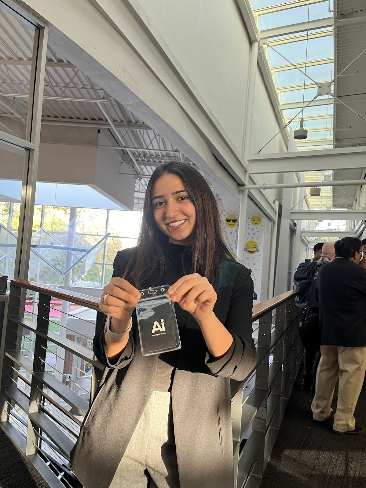

# Hi, I'm Julia! 👋

Welcome to my GitHub profile! I’m passionate about **data science**, **AI/ML**, and **responsible computing**. From building machine learning pipelines to leading teams, I aim to make an impact through innovative, data-driven solutions. Feel free to explore my repositories and connect with me!

---

## 🔗 About Me

- 🎓 Sophomore **Data Science Student** at **SJSU**
- 💡 Passionate about solving complex problems with **AI/ML**, **data science**, and **responsible tech practices**
- 🤝 Dedicated to leading **diverse teams** and achieving impactful goals effectively

📍 **Where You’ll Find Me**:
- 💼 [LinkedIn](https://www.linkedin.com/in/julia-husainzada/)
- ✉️ [Email](mailto:juliahusainzada@gmail.com)

---

## 🛠️ Tools & Languages

### **Languages**:
- Python
- Java
- HTML, CSS, JavaScript

### **Tools & Frameworks**:
- Scikit-learn
- TensorFlow
- Keras
- Pandas & NumPy
- React & Next.js
- Jupyter Notebook

---

## 💻 Featured Repositories

### 1. [Exploring Principal Component Analysis (PCA)](https://github.com/juliahusainzada/PCALinearAlgebra)
A **linear algebra-based project** focused on dimensionality reduction using PCA:
- Applied PCA to reduce dataset dimensions while preserving variance
- Visualized key patterns and feature contributions with intuitive plots
- Demonstrated practical applications using real-world datasets like the Iris dataset

### 2. [NYC Airbnb Price Prediction](https://github.com/juliahusainzada/Airbnb-Pricing-Analysis)
A **machine learning project** predicting Airbnb prices using:
- **Scikit-learn pipelines** for feature engineering
- **Natural Language Processing (NLP)** on amenities data
- Robust performance evaluation metrics

### 3. [SVM Sentiment Analysis of Customer Feedback](https://github.com/juliahusainzada/Neural-Network-Sentiment-Analysis)
A **Support Vector Machine (SVM)-based project** for:
- Analyzing customer feedback sentiment
- Data preprocessing with **TF-IDF vectorization**
- Visualizing sentiment trends

---

## 📊 What I'm Working On

🔍 **Predicting Repeat Donors with KPMG**
- **Objective**: Analyze donation history for nonprofits and predict donor behavior
- **Techniques**: Machine learning models like **Random Forests**
- **Impact**: Improve outreach strategies by identifying patterns in donation data
